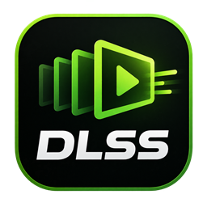
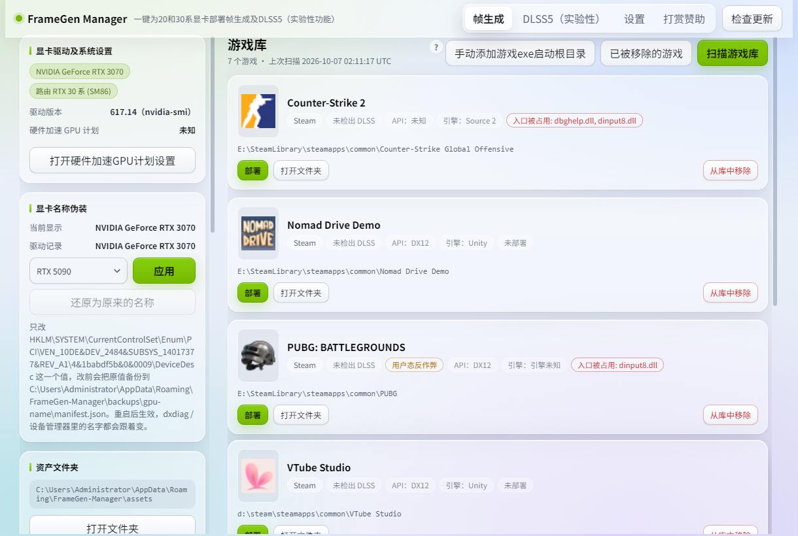
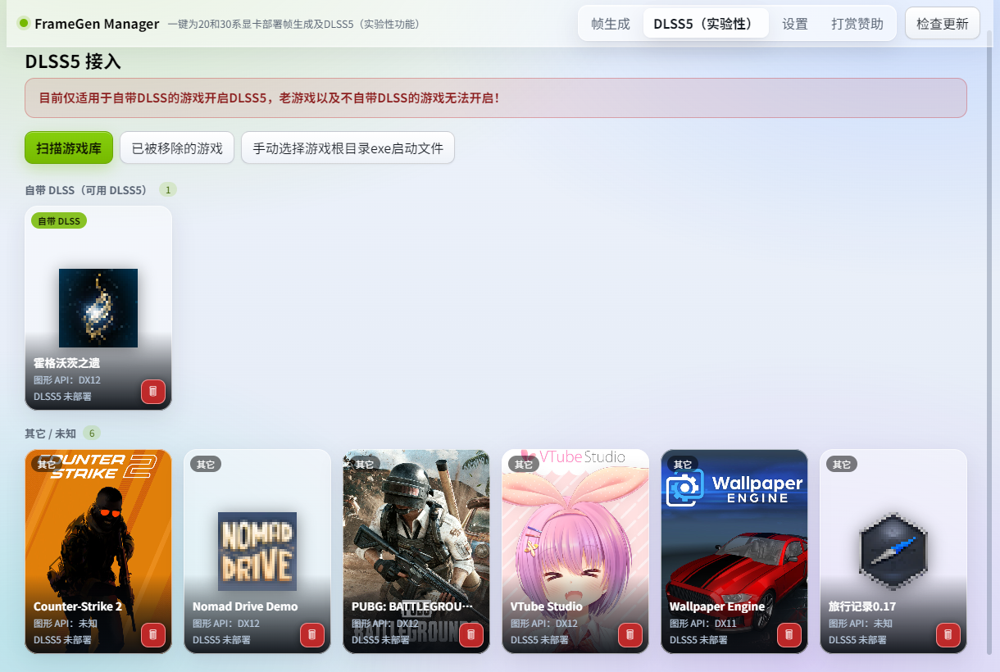
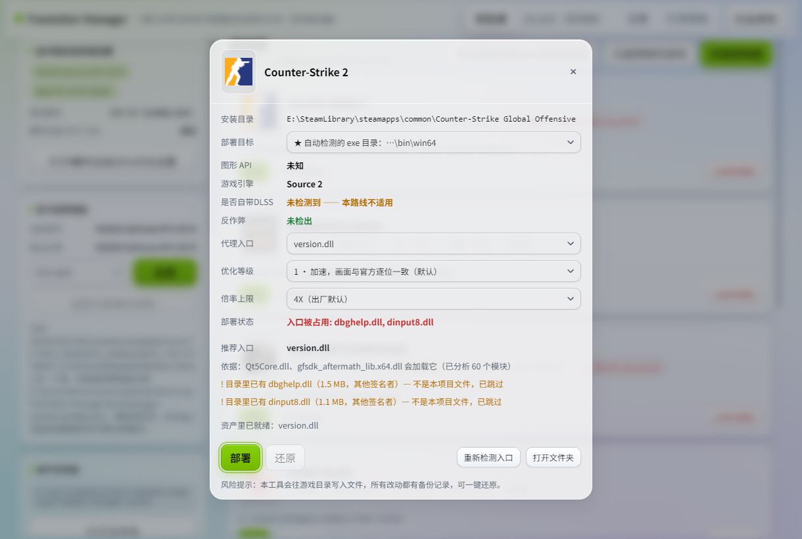
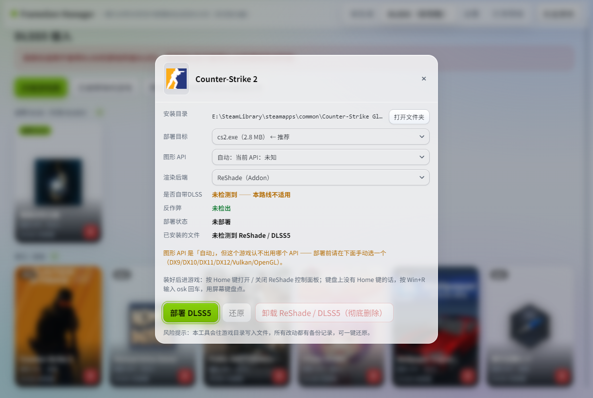

<h1 align="center">FrameGen Manager</h1>

  给 RTX 20 / 30 系显卡的游戏<b>一键开启 DLSS 帧生成</b>，并接入 <b>DLSS 5</b> 神经渲染（实验性）

  
  
  
  

Windows 桌面工具，把 [sdli1995/dlssg_for_sm86](https://github.com/sdli1995/dlssg_for_sm86)
的代理 DLL + 配置部署到游戏渲染 EXE 所在目录，并自动处理 DLSS 运行库、显卡路由和入口冲突。

## 界面

| 游戏库（帧生成） | DLSS5 接入 |
|---|---|
|  |  |
| **帧生成部署** | **DLSS5 部署** |
|  |  |

左侧常驻三张卡片：显卡驱动与系统设置、**显卡名称伪装**（可选）、资产文件夹
右上角四个页签：帧生成 / DLSS5（实验性）/ 设置 

## 下载和使用

- **安装版（推荐）**：到 [Releases](../../releases) 下 `FrameGen-Manager-v<版本>-setup.exe`，
  双击安装。中文向导，可以改安装目录（默认 `C:\Program Files\FrameGen Manager`）。
  卸载走「设置 → 应用」：**手动卸载会连数据一起清干净，静默卸载（更新时的卸载）保留全部数据**。

**不需要装任何运行库**
界面默认走 GPU 渲染。

帧生成使用步骤：
1. 点右上「扫描游戏库」自动找 Steam / Epic / WeGame 的游戏；扫不到的用
   **「手动添加游戏exe启动根目录」**（按钮左上角的问号有说明）指到游戏渲染 EXE 所在的文件夹
2. **不需要下载资产**：上游的代理 DLL、INI 和两个 DLSS 运行库都随安装包一起带了，装完即可用
3. 在游戏那一行点「部署」→ 选**部署目标**（自动检测的 exe 目录，或手动指定启动 exe）、
   代理入口和部署档位 → 点「部署」

进游戏后在画面设置里打开 DLSS 帧生成。**装好 DLSS5 后进游戏按 Home 键**可以打开 / 关闭
ReShade 控制面板（键盘上没有 Home 键的话，按 Win+R 输入 osk，用屏幕键盘点）。

> **注意**：程序没有买代码签名证书，Windows 可能弹「已保护你的电脑」。
> 点「更多信息」→「仍要运行」即可

## 会往游戏目录放什么

| 文件 | 用途 |
|---|---|
| version.dll | 代理入口（名字被占用时自动改用 winmm / dbghelp / dinput8 / dxgi / d3d12） |
| dlssg_sm86.ini | 配置（出厂两个开关：Optimized 优化等级 0~3、MaxGeneratedFrames 倍率上限；20 / 30 系通用） |
| nvngx_dlssg.dll | DLSS 帧生成运行库 |
| nvngx_dlss.dll | DLSS 超分运行库 |

全部放在游戏**实际渲染 EXE 所在目录**（通常是 ...\Binaries\Win64\）

部署前会先备份被覆盖的原文件，随时可以在「部署」卡片点「还原」把游戏目录恢复原样。

### RTX 20 和 30 系用的是同一套文件

上游 **0.3.1 起**，根目录那份 version.dll + 出厂 dlssg_sm86.ini 在 RTX 20 系（Turing / SM75）
和 RTX 30 系（Ampere / SM86）上都能用：**不需要加任何键**，内核族按物理显卡自动选。
所以本工具不再区分这两代卡，也没有「切换版本」那一说 —— 点「下载 / 更新资产」再「部署」即可。

（历史：上游 0.3.0 在任何 RTX 20 上都开不了帧生成 —— 它向 NGX 核心报告的架构不是真实架构，
核心会直接拒绝，对应上游 issue #491 / #492；0.3.1 修好了。）

### 优化等级与倍率上限（「部署」卡片里直接选）

上游 0.3.2 起这两个开关做成了「部署」卡片上的两个下拉框，**只写进部署到游戏目录的那一份**（资产目录里的原文件不动）：

- **优化等级** `Optimized`：`0` 原厂内核不加速 / **`1` 全部加速且画面与官方逐位一致（出厂默认）** / `2` 再加有损图像内核（更快，对官方画面 PSNR 约 50 dB 以上）/ `3` 全部有损（最快）。`2`、`3` 只在最新版（310.9）上有效，画面不再与官方逐位一致。
- **倍率上限** `MaxGeneratedFrames`：**4X（出厂默认）** / 6X（改成 5；只在最新版支持，且要游戏自带的插件也支持）。

两个都保持默认时，工具**一个字都不改**，直接用上游原文件；改了档位才写一份部署用的 INI。

> 📌 上游 **0.3.3** 起档位 `1` 不再跳过重复的真实帧拷贝（`SkipRepeatedRealCopy`，各档位默认关）：
> 0.3.2 上有用户遇到画面闪烁（上游 issue #532），**升级到 0.3.3 即可**。

**DLSS5（新）**

- 一键**自动部署**：官方 ReShade 安装器静默运行（本体随安装包内置）
- 打开部署对话框会**检测已安装的内容** —— 不看本工具的记录，你手动装过的也认
- 【**卸载 ReShade / DLSS5（彻底删除）**】：官方卸载器删本体 / ReShade.ini / ReShade.log /
  效果包目录，本工具再补删预设、插件、模型和插件运行时残渣，最后复查；执行前二次确认并逐条列出
- 部署完成后会提示进游戏按 **Home** 开面板（没有 Home 键就 Win+R → osk）

**帧生成**

- **手动部署过的也能「还原」**：目录里的帧生成文件不是本工具放的（没有备份记录）时，
  还原按钮会变成【清理手动安装】，把认得出的帧生成文件删掉，目录回到干净状态
  （没有备份，所以恢复不了原件，确认框里会写明）
- 安装包**内置全部资产**：装完即可部署，不必再等约 95 MB 的下载
- 「部署目标」改成下拉：自动检测到的渲染 EXE 目录，或手动指定游戏启动 exe

## DLSS5（实验性）

给**自带 DLSS** 的游戏接入 DLSS 5 的神经渲染（走 ReShade 插件那一套，与帧生成互相独立）。

- **一键部署**：DLSS5 页里选游戏 → 确认要装的文件 → 点「部署 DLSS5」。整个过程是自动的：
  官方 ReShade 安装器静默运行（本体从安装包里内嵌的那份解开，不联网、不用点界面），
  然后铺插件与模型，最后按 SHA256 逐个核对。只有两种情况需要你参与：Vulkan 模式要过一次 UAC，
  以及游戏没退干净导致文件被占用（会直接报错，不会写坏）。
- **装完怎么用**：进游戏按 **Home** 打开 / 关闭 ReShade 控制面板。键盘上没有 Home 键的话，
  按 **Win+R** 输入 **osk** 回车，用屏幕键盘点。游戏左上角那行提示是**插件自己的状态提示**，
  只在神经渲染没生效时出现 —— 在 ReShade 覆盖层的 Add-ons → DLSS 5 Neural Rendering 里
  打开开关（或按它列出的 NR 热键）就不再出现。
- **能检测、也能卸干净**：打开部署对话框会显示「已安装的文件」。**不看本工具的记录也认** ——
  你自己手动装过的 ReShade / 插件 / 模型同样能查出来，并且给一个
  **「卸载 ReShade / DLSS5（彻底删除）」**：官方卸载器删本体 + ReShade.ini + ReShade.log +
  效果包目录，本工具再补删预设、插件、模型和插件运行时残渣，最后复查一遍。
  这是**永久删除（不进回收站）**，执行前有二次确认并逐条列出要删的文件。
- **模型的适用范围**：内置的神经网络模型只对 20 / 30 系（SM86 / SM75）有效；其它显卡会被拦下。

## 显卡名称伪装（高级 · 可选 · 谨慎）

> ⚠ **这个功能不是必须的。** 只有在某个游戏里「帧生成」选项根本不出现、
> 而且你已经按上面三步正常部署过的情况下，才建议尝试。

少数游戏只根据显卡型号决定要不要开放帧生成的设置入口，RTX 20 / 30 系会被判成不支持。

> 💡 **先试最新版**：上游 **0.3.3** 起会在游戏启动时就把显卡架构改报成 RTX 50，所以"按型号 / 架构
> 判断"的那类游戏（含《最终幻想 7 重生》这种 Streamline 2.8 游戏）**默认就放开了**，不用改注册表。
> 只有在最新版上仍然不出现选项时，才考虑下面两种做法。
>
> 💡 其次才是 INI 键：上游提供了**只写在 INI 里**的 `[Compatibility] SpoofArchToGame`：写进
> 部署到游戏目录的那份 `dlssg_sm86.ini`，只影响这一个游戏、不动注册表、不要管理员权限。
> 能用它就别用下面这种改注册表的做法。

- **只改一个值**：`HKLM\SYSTEM\CurrentControlSet\Enum\PCI\<你的显卡>\<实例>\DeviceDesc`。
  `HardwareID`、`CompatibleIDs`、`Driver`、`Service`、`Mfg` 一律不碰
- 型号**只能从固定名单里选**（RTX 5090 / RTX 5060 两档），不支持手动输入
  —— 就是为了避免把型号填错
- 写之前会先把原值备份到程序同级的 `backups\gpu-name` 并**读回校验**，
  校验不过就中止，不会动注册表
- 需要管理员权限（点下去会弹一次 UAC），**重启之后才生效**
- 随时可以还原，两种目标任选：
  - **还原为驱动记录的名称** —— 彻底去掉伪装，回到你的真实型号
  - **还原为改动前的值** —— 回到本工具第一次动手之前的状态

**副作用（点「应用伪装」前请务必看完）：**

1. 显卡名和硬件 ID 不一致，**内核级反作弊可能判定异常 —— 有封号风险**
2. NVIDIA App / 驱动安装程序可能识别错型号，导致驱动更新或「优化」失败
3. 重装驱动或大版本更新后会被重置，需要重新设一次
4. dxdiag、设备管理器、任务管理器里显示的显卡名都会跟着变
5. **不保证一定生效**：如果游戏是看硬件 ID 判断型号的，改名没有任何作用
6. 部分按型号生效的 NVIDIA 功能（DLSS 覆盖、控制面板选项）可能受影响

## 许可

[MIT](LICENSE)。第三方组件许可见 [THIRD_PARTY_NOTICES.txt](THIRD_PARTY_NOTICES.txt)。

开发相关的说明（构建、测试、打包、实现原理）见 [DEVELOPING.md](DEVELOPING.md)。
